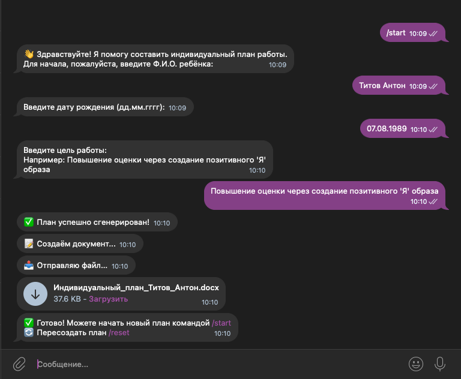

# 🤖 PlanGenerator-Telegram_bot

Бот собирает необходимую информацию через диалог с пользователем, использует Google Gemini API для генерации содержания плана и формирует итоговый документ в формате `.docx`.

# 🚀 Основные функции для пользователя 

*   **Сбор данных:** Ведет диалог с пользователем для получения Ф.И.О. ребенка, даты рождения и основной цели работы.
*   **Генерация контента:** Отправляет запрос к Google Gemini API с указанной целью для получения структурированного плана (Направление -> Коррекционные задачи -> Темы занятий).
*   **Создание документа:** Формирует `.docx` файл, включающий:
    *   Стандартную шапку (название учреждения, ФИО педагога).
    *   Информацию о ребенке (ФИО, дата рождения, цель).
    *   Таблицу с сгенерированным планом и дополнительными колонками (Кол-во занятий, Динамика).
*   **Отправка файла:** Отправляет готовый `.docx` документ пользователю через Телеграм.
*   **Интерактивность:** Предоставляет команды для управления:
    *   `/start`: Начать процесс создания нового плана.
    *   `/reset`: Повторно сгенерировать план, используя последние введенные данные (ФИО, дата рождения, цель). Полезно, если результат генерации не устроил.
    *   `/cancel`: Отменить текущую операцию сбора данных.
*   **Обратная связь:** Информирует пользователя о статусе подключения к API и процессе генерации.
*   **Безопасность:** Считывает чувствительные данные (токен бота, API-ключ) из переменных окружения, а не хранит их в коде.

# 🔌 Конфигурация

Перед запуском бота необходимо настроить переменные окружения для доступа к API:

1.  **`TELEGRAM_BOT_TOKEN`**: Токен вашего Telegram-бота. Получите его у [@BotFather](https://t.me/BotFather).
2.  **`GEMINI_API_KEY`**: Ваш API-ключ для Google Gemini. Получите его в [Google AI Studio](https://aistudio.google.com/app/apikey) или Google Cloud Console.

## Требования

*   Python 3
*   Библиотека `python-telegram-bot` для взаимодействия с Telegram API.
*   Библиотека `requests` для выполнения HTTP-запросов к Gemini API.
*   Библиотека `python-docx` для создания и редактирования документов Word (`.docx`).
*   Google Gemini API для генерации текста.
